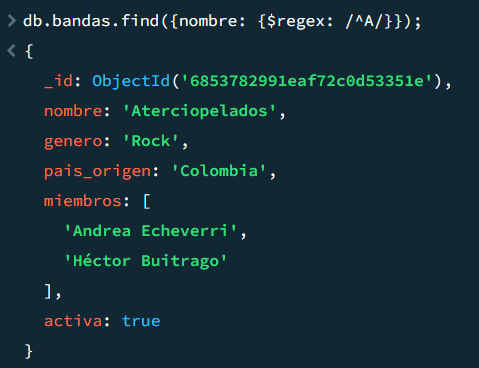
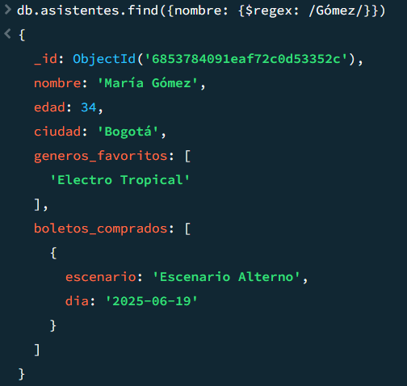
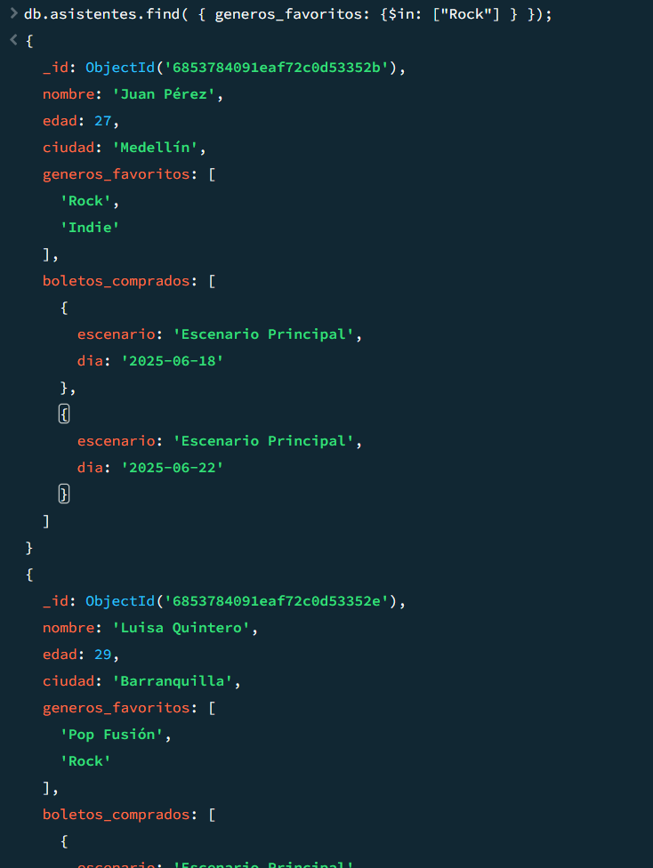
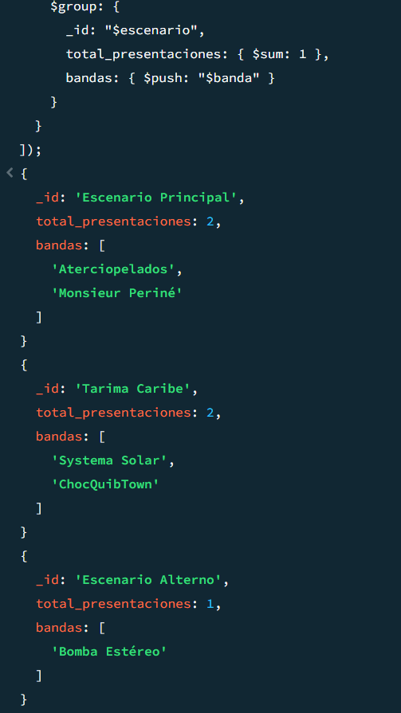
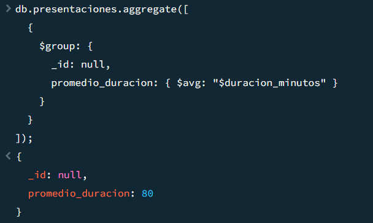
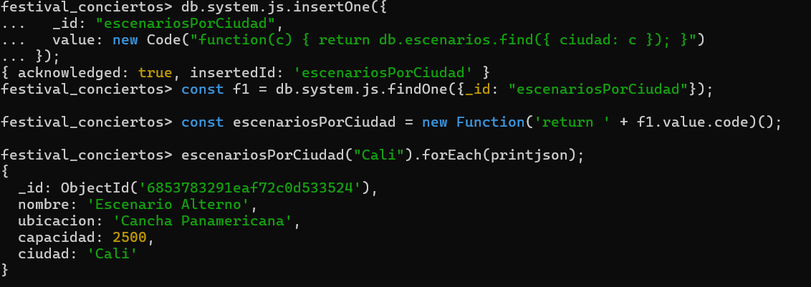

# Festival de Conciertos en Colombia - MongoDB

## 👥 Integrantes
- Daniel Florez Cubides
- Mateo Paternina Mercado

## 📋 Descripción del Proyecto
Este proyecto implementa una base de datos MongoDB para gestionar un festival de conciertos en Colombia, incluyendo información sobre bandas, escenarios, presentaciones y asistentes.

## 🗄️ Estructura de la Base de Datos

### Colecciones:
- **bandas**: Información de las bandas participantes
- **escenarios**: Detalles de los escenarios del festival
- **presentaciones**: Programación de conciertos
- **asistentes**: Información de los asistentes y sus boletos

## 🔍 Consultas Implementadas

### 1. Expresiones Regulares

#### Bandas que empiecen por "A"
```javascript
db.bandas.find({ nombre: {$regex: /^A/} });
```
**Resultado**: Encuentra "Aterciopelados"



#### Asistentes con "Gómez" en el nombre
```javascript
db.asistentes.find({ nombre: {$regex: /Gómez/} });
```
**Resultado**: Encuentra "María Gómez"



### 2. Operadores de Arreglos

#### Asistentes que les gusta el Rock
```javascript
db.asistentes.find({ generos_favoritos: {$in: ["Rock"] } });
```
**Resultado**: Encuentra "Juan Pérez" y "Luisa Quintero"



### 3. Aggregation Framework

#### Presentaciones por escenario
```javascript
db.presentaciones.aggregate([
  {
    $group: {
      _id: "$escenario",
      total_presentaciones: { $sum: 1 },
      bandas: { $push: "$banda" }
    }
  }
]);
```
**Resultado**:
- Escenario Principal: 2 presentaciones
- Tarima Caribe: 2 presentaciones  
- Escenario Alterno: 1 presentación



#### Promedio de duración
```javascript
db.presentaciones.aggregate([
  {
    $group: {
      _id: null,
      promedio_duracion: { $avg: "$duracion_minutos" }
    }
  }
]);
```
**Resultado**: 80 minutos promedio



## 🔧 Funciones del Sistema

### escenariosPorCiudad(ciudad)
Función que devuelve todos los escenarios en una ciudad específica.

```javascript
db.system.js.insertOne({
  _id: "escenariosPorCiudad",
  value: new Code("function(c) { return db.escenarios.find({ ciudad: c }); }")
});

const f1 = db.system.js.findOne({_id: "escenariosPorCiudad"});

const escenariosPorCiudad = new Function('return ' + f1.value.code)();

escenariosPorCiudad("Cali").forEach(printjson);
``` 




## 📈 Estadísticas del Festival
- **Total de bandas**: 5
- **Bandas activas**: 4
- **Total de escenarios**: 3
- **Ciudades participantes**: 3 (Bogotá, Cali, Barranquilla)
- **Asistencia estimada total**: 16,800 personas
- **Duración total del festival**: 400 minutos

## 🎯 Características Adicionales
- Transacciones para operaciones críticas
- Consultas optimizadas con índices
- Funciones reutilizables para análisis
- Agregaciones complejas para estadísticas

### **Funciones en system.js**

1. Crear una función llamada `escenariosPorCiudad(ciudad)` que devuelva todos los escenarios en esa ciudad.
2. Crear una función llamada `bandasPorGenero(genero)` que devuelva todas las bandas activas de ese género :

- Función bandasPorGenero(genero)   
```js
  db.system.js.save({
  _id: "bandasPorGenero",
  value: function(genero) {
    return db.bandas.find({ genero: genero, activa: true }).toArray();
  }
  });

  // Para llamar esta función luego:
  db.loadServerScripts();
  bandasPorGenero("Rock");

```
### **Transacciones (requiere replica set)**

1. Simular compra de un boleto:
    - Insertar nuevo boleto en `boletos_comprados` de un asistente.
    - Disminuir en 1 la capacidad del escenario correspondiente.
```js
// Requiere usar sesión para transacciones
const session = db.getMongo().startSession();

try {
  session.startTransaction();

  // 1. Insertar boleto en el asistente
  db.asistentes.updateOne(
    { nombre: "Juan Pérez" },
    {
      $push: {
        boletos_comprados: {
          escenario: "Tarima Caribe",
          dia: "2025-06-21"
        }
      }
    },
    { session }
  );

  // 2. Disminuir la capacidad del escenario
  db.escenarios.updateOne(
    { nombre: "Tarima Caribe" },
    { $inc: { capacidad: -1 } },
    { session }
  );

  session.commitTransaction();
  print("Compra realizada con éxito");
} catch (e) {
  print("Error, haciendo rollback: ", e);
  session.abortTransaction();
}
session.endSession();

```
2. Reversar la compra:
    - Eliminar el boleto insertado anteriormente.
    - Incrementar la capacidad del escenario.
```   js 
const session = db.getMongo().startSession();

try {
  session.startTransaction();

  // 1. Eliminar el boleto
  db.asistentes.updateOne(
    { nombre: "Juan Pérez" },
    {
      $pull: {
        boletos_comprados: {
          escenario: "Tarima Caribe",
          dia: "2025-06-21"
        }
      }
    },
    { session }
  );

  // 2. Aumentar capacidad del escenario
  db.escenarios.updateOne(
    { nombre: "Tarima Caribe" },
    { $inc: { capacidad: 1 } },
    { session }
  );

  session.commitTransaction();
  print("Compra revertida con éxito");
} catch (e) {
  print("Error al revertir compra: ", e);
  session.abortTransaction();
}
session.endSession();

```
---

### **Índices + Consultas**

1. Crear un índice en `bandas.nombre` y buscar una banda específica por nombre.
2. Crear un índice en `presentaciones.escenario` y hacer una consulta para contar presentaciones de un escenario.
3. Crear un índice compuesto en `asistentes.ciudad` y `edad`, luego consultar asistentes de Bogotá menores de 30.

 Índices y Consultas

1 Índice en bandas.nombre y búsqueda por nombre
```js
// Crear índice
db.bandas.createIndex({ nombre: 1 });

// Consulta
db.bandas.find({ nombre: "Aterciopelados" });

```
2 Índice en presentaciones.escenario y contar presentaciones
```js

// Crear índice
db.presentaciones.createIndex({ escenario: 1 });

// Consulta
db.presentaciones.countDocuments({ escenario: "Tarima Caribe" });

```
3 Índice compuesto en asistentes.ciudad y edad, y consulta
```js
// Crear índice compuesto
db.asistentes.createIndex({ ciudad: 1, edad: 1 });

// Consulta
db.asistentes.find({ ciudad: "Bogotá", edad: { $lt: 30 } });

```
---

